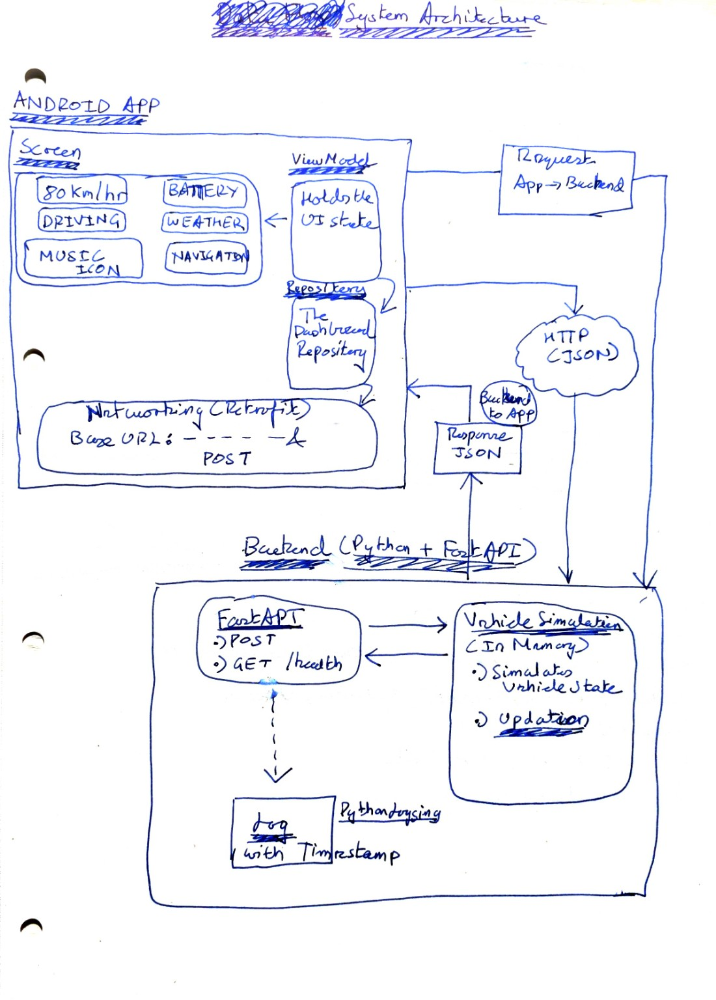
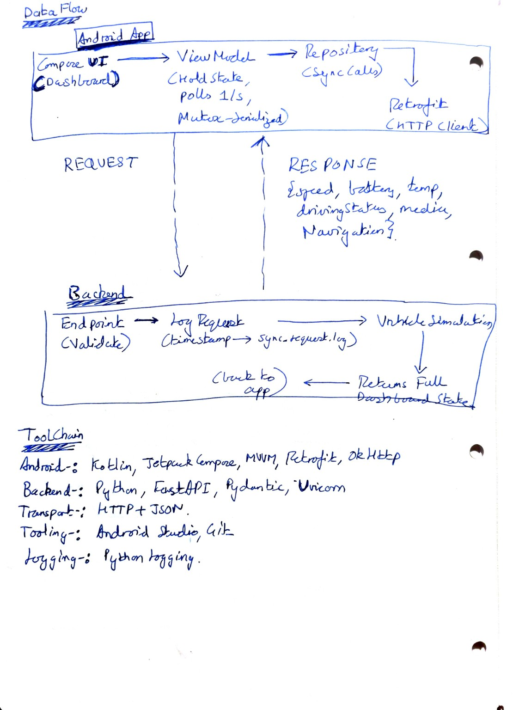

# Simple Cockpit Android

Simple Cockpit Android is a landscape tablet dashboard for simulated vehicle, media, and navigation data supplied by the companion FastAPI backend.

## Architecture

### System Architecture



### Data Flow



The Compose UI observes `DashboardUiState` from a `StateFlow`. `DashboardViewModel` polls once per second and sends playback actions through `DashboardRepository`. `RemoteDashboardRepository` maps those calls to the backend API.

```text
Compose UI → DashboardViewModel → DashboardRepository
→ RemoteDashboardRepository → Retrofit → FastAPI
```

## Technology Choices

- **Kotlin `2.2.10`, Jetpack Compose, and Material 3** were chosen for a type-safe, declarative UI that maps naturally from `DashboardUiState` to the dashboard screen. The Compose BOM `2026.02.01` keeps Compose library versions compatible.
- **Lifecycle `2.9.4`, ViewModel, and StateFlow** keep polling and connection state outside the UI, preserve it through configuration changes, and allow lifecycle-aware collection.
- **Retrofit `3.0.0` with Gson** turns the REST contract into typed Kotlin interfaces and models with little manual serialization code.
- **OkHttp `4.12.0`** supplies the HTTP transport and configurable timeouts, allowing the UI to detect backend loss promptly.
- **Android Gradle Plugin `9.3.1` and the Kotlin Compose plugin** provide the standard Android build pipeline and Compose compiler integration.

## Backend Connection

The emulator connects to `http://10.0.2.2:8000/`. It posts `NONE` during polling and `TOGGLE_PLAYBACK` for the media control. OkHttp connect, read, and write timeouts are three seconds.

## Build and Run

Start the backend on port `8000`. From `cockpit-android/`, run:

```powershell
.\gradlew.bat :app:checkDebugAarMetadata --console=plain
.\gradlew.bat :app:assembleDebug --console=plain
```

Run the focused local unit tests:

```powershell
.\gradlew.bat :app:testDebugUnitTest --console=plain
```

Install and run the debug build on a landscape tablet emulator. Runtime screenshots are in `docs/screenshots/`.

## Failure Handling

A coroutine `Mutex` prevents polling and playback requests from overlapping. After a failed request, the ViewModel keeps the last successful dashboard state, marks the connection unavailable, and continues polling. A later successful response clears the error state automatically.

## Limitations

- The backend URL is fixed to the Android emulator host alias.
- Cleartext HTTP is enabled for local development.
- Polling uses a fixed one-second interval without backoff.
- The layout targets landscape tablets.
- No emulator-based automated UI tests are included.